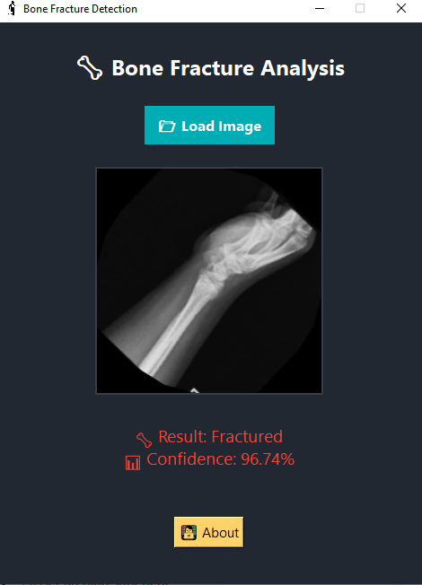

# 🦴 Bone Fracture Detection – Tkinter + Deep Learning App

<p align="center">
  
</p>

## 📌 Overview
This is a desktop GUI application developed in **Python** using **Tkinter**, designed to automatically detect bone fractures in X-ray images with the help of a pre-trained deep learning model (TensorFlow/Keras).

---

## 💡 Features

- 🧠 Uses a trained Keras model to classify X-ray images as:
  - Fractured
  - Not Fractured
  
- 📷 Clean and intuitive GUI for loading and analyzing images.

- 📊 Displays prediction confidence.

- 🖼️ Shows the loaded X-ray image within the interface.

- 👨‍💻 "About" window with developer details.

- 🎨 Sleek and modern design with soft color palette.

---

## 🧪 Requirements

Make sure the following Python libraries are installed:

```bash
pip install tensorflow pillow numpy
```

---

## 🗂️ Project Structure

```
📁 fracture_detection_app/
├── fracture_model.keras        # Pre-trained model
├── trauma.png                  # App icon
├── main.py                     # Main application script
└── README.md                   # This file
```

---

## 🚀 How to Run

1. Ensure the following files are in the same directory:
   - `main.py`
   - `fracture_model.keras`
   - `trauma.png`

2. Run the application using:

```bash
python main.py
```

3. Click 📂 **Load Image** to choose an X-ray image.

4. The application will display:
   - The result: Fractured / Not Fractured
   - The prediction confidence

5. Click 👨‍💻 **About** to view developer information.

---

## 👨‍💻 Developer

- **Name:** Bouagal Houssem Eddine  
- **Field:** Artificial Intelligence & User Interfaces  
- **Language:** Python (Tkinter + TensorFlow)

---

## 📌 Notes

- ✅ The AI model is pre-trained and loaded at runtime.
- 📦 You can convert the project into an executable using `pyinstaller` or `auto-py-to-exe`.

---

## 🧊 Screenshot

> *Add a screenshot here later if needed:*

```md

```
